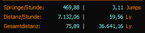
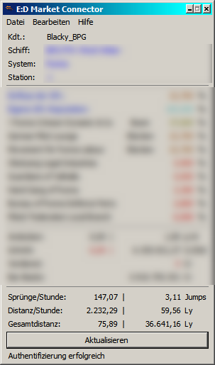
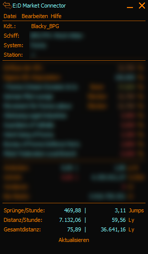
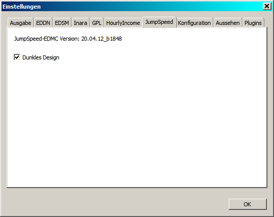

# JumpSpeed EDMC Plugin

Das ist ein einfaches Plugin für den [ED MarketConnector](https://github.com/Marginal/EDMarketConnector/wiki), basierend auf dem Original [EDMCJumpSpeed](https://github.com/Exynom/EDMC-HourlyIncome) vom inorton!



 


## Installation

So wie auch alle anderen EDMC-Plugins wird der Ordner aus dem heruntergeladenen Archiv in den Plugin-Ordner eures EDMC's entpackt, das sollte danach dann in etwa so aussehen:
```
$AppPath$\EDMarketConnector\plugins\JumpSpeed
```
Nach dem starten des EDMC ist das Plugin sofort einsatzbereit, es ist bereits kompatibel mit der neuen BETA-Version des EDMC 3.50 beta0, funktioniert jedoch auch in der Version 3.43 des EDMC.


## Anzeigen

Es wird folgendes im Plugin angezeigt:

- Zeile 1:
- - Links: Sprünge pro Stunde dieser Sitzung
- - Rechts: Sprünge pro Stunde gesamte Spielzeit
- Zeile 2:
- - Links: Sprungdistanz pro Stunde dieser Sitzung
- - Rechts: Sprungdistanz pro Stunde gesamte Spielzeit
- Zeile 3:
- - Links: Gesamtdistanz dieser Sitzung
- - Rechts: Gesamtdistanz gesamte Spielzeit

Die Zeit die ein Profil gespielt wurde sowie aktuelle Sprungdistanz und die Anzahl der durchgeführten Sprünge wird beim Laden des Spieles (also EDMC vorher starten) abgefragt.


## Wichtiges

Das Plugin erkennt nicht automatisch welches Design (Theme) man in EDMC aktiviert hat, weshalb es eine Optionsseite mit der möglichkeit der Designwahl für das Plugin gibt.




## Weiteres

Dieses Plugin ist lediglich für eigene statistische Auswertungen gedacht und synchronisiert sich selbst in keinster Weise mit irgendwelchen anderen Plattformen.
Für jene welche in anderen Sprachen spielen ist es möglich weitere Übersetzungsdateien an zu legen, diese kommen dann ebenso wie die deutsche Übersetzung in den L10n Ordner innerhalb des Plugin-Ordners.
